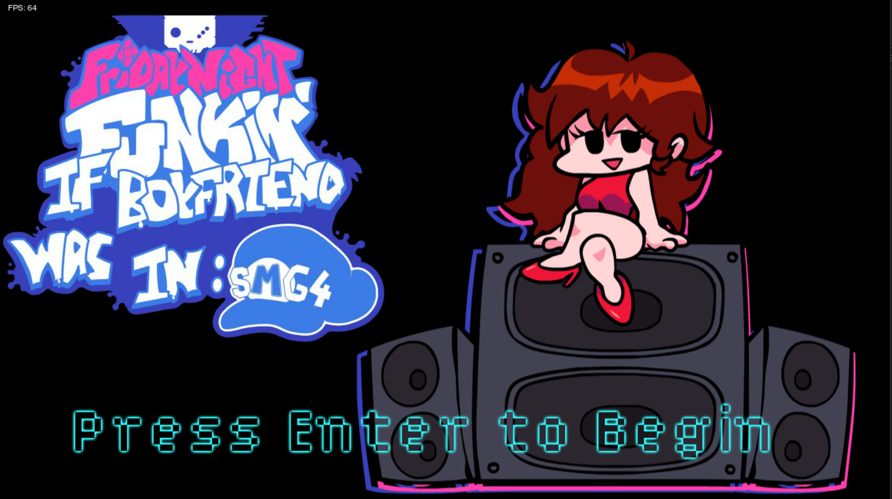
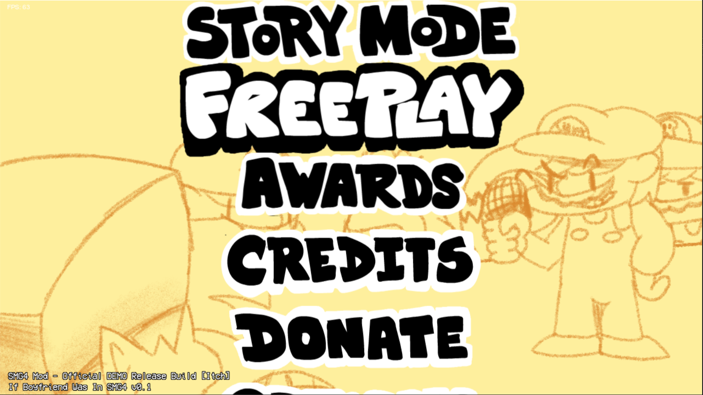
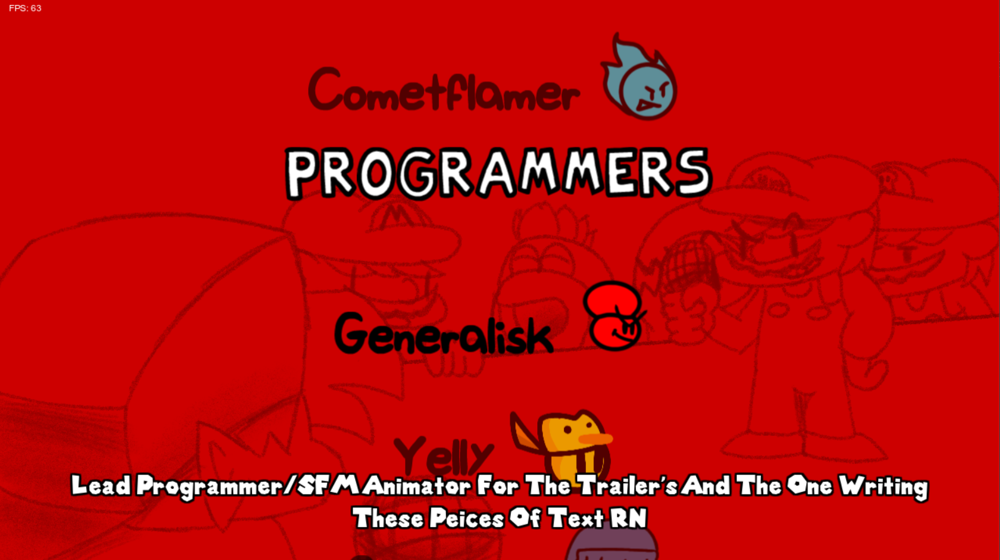
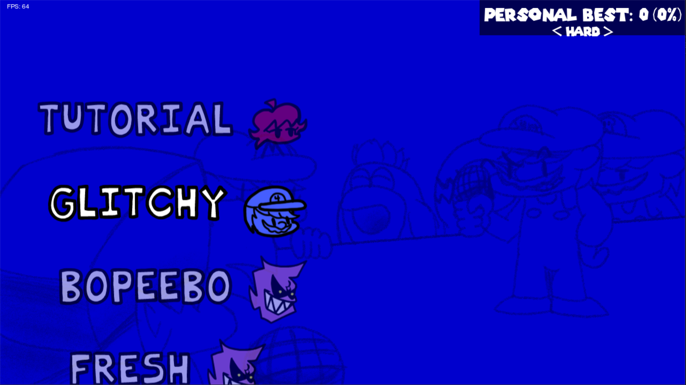
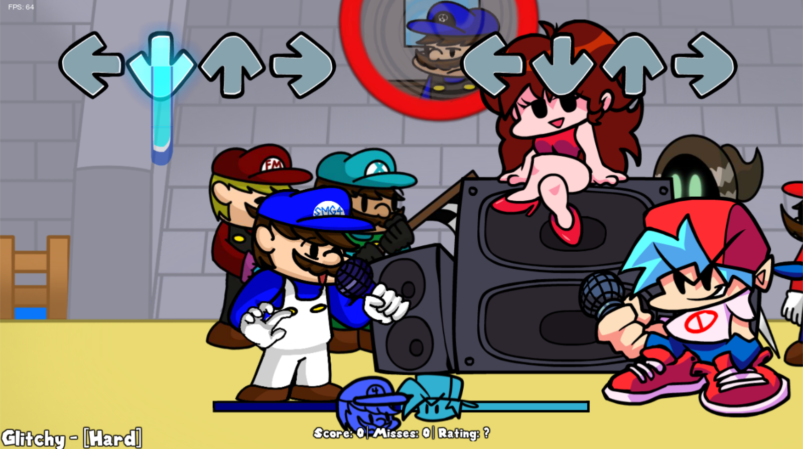

# If Boyfriend Was In SMG4
A FNF Mod Inspired By The YouTuber [SMG4](https://www.youtube.com/c/SMG4). The Mod Is Ran On Psych Engine 0.4.2.
# Feature's
This Mod Contains

1 New Song
- Glitchy
- A Test Song Which Still Exists In The Game Files Lol

1 New Character
- SMG4

1 New Stage
- Peachs Castle

1 New Week
- VS SMG4 (Luke)
# Previews ([skip](#credits))
(Screenshot's Taken From Itch Build 0.1)

# Credits
[Insert Credits Here! I'll Finish Them Later]
# How To Install
Download The Repo And Run The Folder Is VS Code, Idiot!
# How To Build
If You Don't Have HaxeFlixel Or The Required Package's Installed, Do The Following
1) Install [Haxe 4.1.5](https://haxe.org/download/version/4.1.5/) (Version 4.1.5 Is Reccomended As Older/Newer Versions Can Be Unstable)
2) Install [HaxeFlixel](https://haxeflixel.com/documentation/install-haxeflixel/) (Require's Haxe Installed To Install)
3) Install [Git](https://git-scm.com/downloads)
4) Run The Following Commands:
- `haxelib install flixel`
- `haxelib install flixel-addons`
- `haxelib install flixel-ui`
- `haxelib install hscript`
- `haxelib install newgrounds`
- `haxelib install linc_luajit`

Now You Have HaxeFlixel And The Required Packages:
- In The Repository, Run The Bat File `compile-[PlatformName].bat`
# TODO: Finish Writing This README
